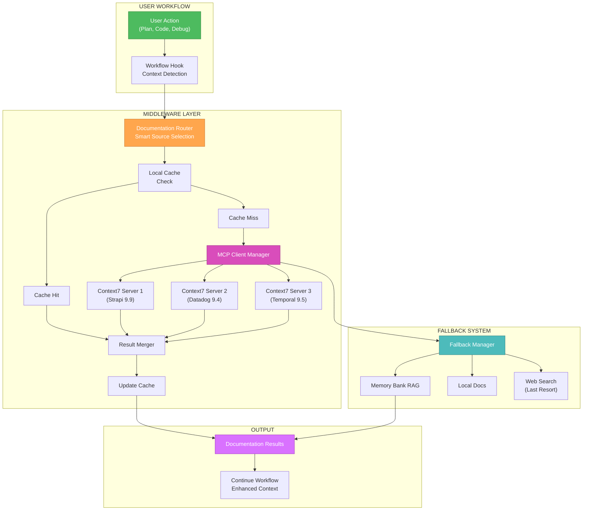
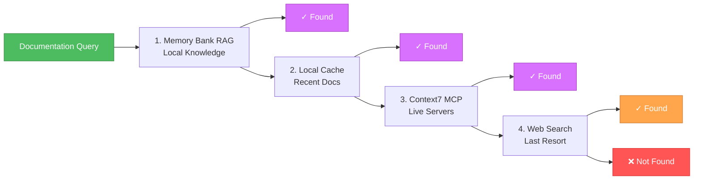

# 🎨 CREATIVE PHASE: CONTEXT7 INTEGRATION PATTERN

## 🏗️ Architecture Decision Record

### Context

**System Requirements:**
- Seamless integration Context7 MCP в existing workflow
- Zero breaking changes для current development process
- Automatic best practices loading вместо web searches
- Fallback mechanisms при недоступности Context7 servers
- Smart caching для frequently accessed documentation

**Technical Constraints:**
- Some direct Context7 servers unavailable (FastAPI, React)
- 40+ high-quality alternative documentation sources available
- Existing Docker-based development environment
- Current workflow patterns должны остаться unchanged
- MCP protocol integration requirements

### Component Analysis

**Core Components:**

1. **MCP Client Manager**:
   - Purpose: Handle connections к multiple Context7 servers
   - Role: Primary interface для external documentation

2. **Documentation Router**:
   - Purpose: Route queries к most relevant documentation source
   - Role: Smart selection между available servers

3. **Local Cache System**:
   - Purpose: Store frequently accessed documentation locally
   - Role: Performance optimization и offline capability

4. **Workflow Hooks**:
   - Purpose: Integration points в existing development commands
   - Role: Transparent documentation injection

5. **Fallback Manager**:
   - Purpose: Handle server unavailability gracefully
   - Role: Reliability и resilience component

**Component Interactions:**
- User Action → Workflow Hook → Documentation Router → MCP Client → External Docs
- Documentation Router → Local Cache (read/write)
- MCP Client failure → Fallback Manager → Alternative sources
- Workflow Hook → RAG System (for memory-bank content)

## 🔍 Integration Pattern Options Analysis

### Option 1: Middleware Integration Pattern (Recommended)

**Description**: Insert Context7 integration as middleware layer between user actions и existing workflow

**Pros:**
- ✅ **Zero Breaking Changes**: Existing commands work unchanged
- ✅ **Transparent Operation**: Documentation loading happens behind the scenes
- ✅ **Gradual Adoption**: Can be enabled/disabled per user preference
- ✅ **Easy Rollback**: Remove middleware без system changes
- ✅ **Future Proof**: Easy to add new documentation sources

**Cons:**
- ❌ **Slight Overhead**: Additional layer в call chain
- ❌ **Complexity**: Middleware logic needs careful design

**Technical Fit**: ⭐⭐⭐⭐⭐ **High** - Perfect для non-breaking integration
**Complexity**: ⭐⭐⭐ **Medium** - Standard middleware patterns
**Maintainability**: ⭐⭐⭐⭐⭐ **High** - Clean separation of concerns

### Option 2: Command Extension Pattern

**Description**: Extend existing commands с Context7 functionality, add new flags/options

**Pros:**
- ✅ **Explicit Control**: Users know when Context7 is being used
- ✅ **Simple Implementation**: Direct command modifications
- ✅ **Clear Debugging**: Easy to trace Context7 vs regular operations

**Cons:**
- ❌ **Breaking Changes**: Existing commands need modification
- ❌ **User Training**: Users need to learn new command options
- ❌ **Fragmented Experience**: Different behavior для different commands

**Technical Fit**: ⭐⭐⭐ **Medium** - Works но requires changes
**Complexity**: ⭐⭐ **Low** - Simple implementation
**Maintainability**: ⭐⭐ **Low** - Scattered modifications

### Option 3: Proxy Service Pattern

**Description**: Create dedicated Context7 proxy service, route all documentation requests through it

**Pros:**
- ✅ **Centralized Logic**: All Context7 logic в one service
- ✅ **Independent Scaling**: Can scale proxy separately
- ✅ **Advanced Features**: Circuit breakers, rate limiting, etc.

**Cons:**
- ❌ **Added Complexity**: New service to maintain
- ❌ **Network Overhead**: Additional service call latency
- ❌ **Single Point of Failure**: Proxy failure affects all documentation

**Technical Fit**: ⭐⭐⭐ **Medium** - Overkill для current needs
**Complexity**: ⭐⭐⭐⭐ **High** - New service management
**Maintainability**: ⭐⭐⭐ **Medium** - Service operations overhead

## 🎯 Decision & Rationale

### **CHOSEN OPTION: Option 1 - Middleware Integration Pattern**

**Primary Rationale:**
1. **Zero Breaking Changes**: Critical requirement satisfied
2. **Future Flexibility**: Easy to modify без affecting core workflow
3. **User Experience**: Transparent enhancement без learning curve
4. **Rollback Safety**: Can disable без system impact
5. **Standard Pattern**: Well-known middleware approach

**Implementation Strategy:**
- **Workflow Detection**: Identify context автоматически (code editing, planning, etc.)
- **Smart Routing**: Route к most relevant documentation source
- **Caching First**: Check local cache before external calls
- **Fallback Chain**: memory-bank RAG → cached docs → Context7 → web search (last resort)

## 📊 Integration Architecture Diagram

## 🔄 Smart Context Detection Strategy

### Workflow Context Mapping:

1. **Planning Phase Context**:
   - Detect: Reading tasks.md, architectural discussions
   - Load: System design patterns, architecture docs
   - Sources: Temporal (distributed systems), Architecture decision records

2. **Code Implementation Context**:
   - Detect: File editing, API development
   - Load: Framework-specific best practices
   - Sources: Strapi (API patterns), Datadog (monitoring)

3. **Debugging Context**:
   - Detect: Error logs, troubleshooting queries
   - Load: Debugging guides, common solutions
   - Sources: Error handling patterns, diagnostic docs

4. **Testing Context**:
   - Detect: Test file editing, CI/CD work
   - Load: Testing frameworks, best practices
   - Sources: Testing documentation, quality patterns

## 🔄 Fallback Chain Strategy

## 🔄 Implementation Plan

### Phase 1: Middleware Foundation (Week 2)
1. **Workflow Hook Implementation**:
   - Identify key integration points в existing workflow
   - Create middleware layer с context detection
   - Implement pass-through mode (no breaking changes)

2. **Documentation Router**:
   - Map project technologies → available Context7 servers
   - Implement smart routing logic
   - Add quality scoring для source selection

### Phase 2: MCP Integration (Week 2)
1. **MCP Client Setup**:
   - Connect к available Context7 servers (Strapi, Datadog, Temporal)
   - Implement connection pooling и retries
   - Add health checking для server availability

2. **Caching System**:
   - Local cache для frequently accessed docs
   - TTL management для freshness
   - Cache invalidation strategies

### Phase 3: Fallback Implementation (Week 2)
1. **Fallback Manager**:
   - Implement fallback chain logic
   - Integration с memory-bank RAG system
   - Graceful degradation при server failures

## ✅ Validation

### Requirements Met:
- ✅ **Seamless integration**: Middleware pattern ensures transparency
- ✅ **Zero breaking changes**: Existing workflow unchanged
- ✅ **Automatic best practices**: Context detection + smart routing
- ✅ **Fallback mechanisms**: Multi-tier fallback chain implemented
- ✅ **Smart caching**: Local cache с intelligent TTL

### Technical Feasibility: ⭐⭐⭐⭐⭐ **EXCELLENT**
- Middleware pattern well-established
- Context7 MCP protocol documented
- Local caching straightforward
- Fallback chain reduces single points of failure

### Risk Assessment: 🟢 **LOW RISK**
- **Breaking changes**: Eliminated by middleware approach
- **Context7 dependency**: Mitigated by fallback chain
- **Performance impact**: Minimal overhead, improved by caching
- **User adoption**: Zero learning curve required

## 🎨 CREATIVE CHECKPOINT: Context7 Integration Pattern Finalized

**Decision Summary**: Middleware Integration Pattern выбран для seamless, non-breaking Context7 integration.

**Key Innovation**: Smart context detection с automatic documentation loading и robust fallback chain.

**Integration Points**: Memory-bank RAG → Local Cache → Context7 MCP → Web fallback

**Next Steps**: Proceed к UI/UX Design phase для user interface decisions.

🎨🎨🎨 **EXITING CREATIVE PHASE - CONTEXT7 INTEGRATION PATTERN DECIDED** 🎨🎨🎨 