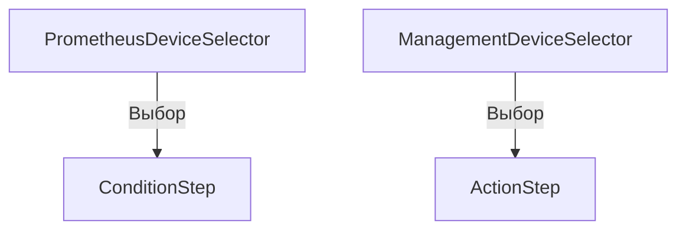

# 🎨 CREATIVE PHASE: Device Selection UX

## PROBLEM STATEMENT

В текущем интерфейсе:
- Нет четкого разделения между устройствами мониторинга (Prometheus) и управляющими устройствами (SMS/управление).
- Пользователь путается, какие устройства можно выбрать для условий, а какие — для действий.
- Нет удобного поиска и фильтрации по платформе, имени, MAC.
- Нет визуальных подсказок о статусе устройства (online/offline).
- Нет единого UX-паттерна для выбора устройств в разных шагах мастера.

**Цель:**  
Сделать выбор устройств максимально простым, быстрым и однозначным для пользователя, с учетом ролевой модели и фильтрации по платформе.

---

## OPTIONS ANALYSIS

### Option 1: Два отдельных компонента выбора (PrometheusDeviceSelector и ManagementDeviceSelector)

**Описание:**  
- Для условий — отдельный компонент выбора устройств мониторинга (только из Prometheus, с фильтрацией по платформе, статусом, поиском по имени/MAC).
- Для действий — отдельный компонент выбора управляющих устройств (из Device модели, с фильтрацией по платформе, поиском, отображением шаблонов команд).

**Плюсы:**
- Максимальная ясность: пользователь не перепутает тип устройства.
- Можно кастомизировать отображение под разные задачи (статус, шаблоны, иконки).
- Легко расширять (например, добавить массовый выбор).

**Минусы:**
- Нужно поддерживать два компонента.
- Немного больше кода.

**Сложность:** Средняя  
**Время реализации:** 1.5 дня фронт

---

### Option 2: Универсальный компонент с переключателем типа

**Описание:**  
- Один компонент выбора устройств, в котором есть переключатель "Мониторинг/Управление".
- В зависимости от режима — подгружаются устройства из Prometheus или Device модели.

**Плюсы:**
- Меньше кода, единый UX.
- Быстро для опытных пользователей.

**Минусы:**
- Пользователь может случайно выбрать не тот тип устройства.
- Сложнее валидировать и объяснить различия.
- Меньше гибкости для кастомизации под разные задачи.

**Сложность:** Средняя  
**Время реализации:** 1 день фронт

---

### Option 3: Автоматический фильтр по контексту шага

**Описание:**  
- Один компонент, который сам определяет, какие устройства показывать, исходя из текущего шага мастера (условие/действие).

**Плюсы:**
- Минимум действий для пользователя.
- UX максимально простой.

**Минусы:**
- Неочевидно, почему на разных шагах разные устройства.
- Сложнее объяснить логику выбора.
- Меньше контроля для пользователя.

**Сложность:** Средняя  
**Время реализации:** 1 день фронт

---

## PROS & CONS SUMMARY

| Вариант      | Ясность для пользователя | Гибкость | Простота реализации | Масштабируемость |
|--------------|-------------------------|----------|---------------------|------------------|
| 2 компонента | +++                     | +++      | ++                  | +++              |
| Переключатель| ++                      | ++       | +++                 | ++               |
| Автофильтр   | ++                      | +        | +++                 | +                |

---

## DECISION

**Рекомендуемый подход:**  
**Два отдельных компонента** — PrometheusDeviceSelector для условий и ManagementDeviceSelector для действий.

**Обоснование:**  
- Максимальная прозрачность для пользователя.
- Легко добавить кастомные подсказки, статус, фильтры.
- Соответствует style guide (карточки, списки, поиск, фильтры).
- Готово к расширению (например, массовый выбор, advanced фильтры).
- Упрощает валидацию и интеграцию с ролевой моделью.

---

## IMPLEMENTATION PLAN

1. **PrometheusDeviceSelector**
   - Источник: `/exporters/devices` (или аналогичный endpoint)
   - Фильтрация по платформе пользователя
   - Поиск по имени и MAC
   - Отображение статуса (online/offline), иконка, цветовая индикация
   - Выбор одного устройства (или опционально нескольких в будущем)
   - Соответствие style guide (карточки, списки, цвета)

2. **ManagementDeviceSelector**
   - Источник: `/devices` endpoint
   - Фильтрация по платформе пользователя
   - Поиск по имени, модели, телефону
   - Отображение доступных шаблонов команд (при выборе устройства)
   - Выбор одного устройства
   - Соответствие style guide

3. **Общее**
   - Компоненты должны быть переиспользуемыми и легко расширяемыми
   - Tailwind классы и UI паттерны из style guide
   - Адаптивность (мобильная версия)
   - Валидация выбора (нельзя продолжить без выбора устройства)

---

## VISUALIZATION

---

🎨 CREATIVE CHECKPOINT: Device Selection UX Decision зафиксирован

---

## Дальнейшие шаги

- Перейти к креативному этапу "Automatic Naming Algorithm"  
- Обновить tasks.md с решением и рекомендациями

🎨🎨🎨 EXITING CREATIVE PHASE - DECISION MADE 