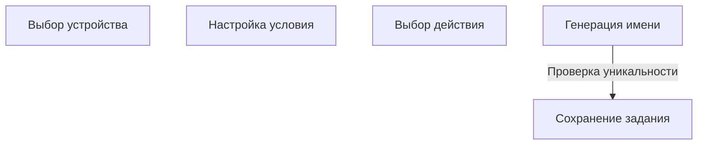

# 🎨 CREATIVE PHASE: Automatic Naming Algorithm

## PROBLEM STATEMENT

В текущем интерфейсе:
- Имя задания вводится вручную, что приводит к ошибкам, дублированию и неинформативным названиям.
- Нет единого стандарта именования, сложно быстро понять, что делает задание.
- Пользователь тратит время на придумывание имени, хотя оно может быть сгенерировано автоматически на основе выбранных параметров.

**Цель:**  
Автоматически генерировать осмысленные, уникальные и информативные имена заданий на основе выбранных устройств, условий и действий.

---

## OPTIONS ANALYSIS

### Option 1: Шаблон "Мониторинг [Имя устройства] - [Условие]"

**Описание:**  
Имя формируется по шаблону:  
`Мониторинг [Имя устройства] - [Метрика] [Оператор] [Значение]`

**Плюсы:**
- Максимальная информативность
- Легко реализовать
- Пользователь сразу видит, что мониторится и по какому условию

**Минусы:**
- Длинные имена при сложных условиях
- Не учитывает действие (только условие)

**Сложность:** Низкая  
**Время реализации:** 0.5 дня

---

### Option 2: Шаблон с действием "Мониторинг [Имя устройства] → [Действие] при [Условие]"

**Описание:**  
Имя формируется по шаблону:  
`Мониторинг [Имя устройства] → [Действие] при [Метрика] [Оператор] [Значение]`

**Плюсы:**
- Еще более информативно (видно и условие, и действие)
- Удобно для аудита и поиска

**Минусы:**
- Имя может быть очень длинным
- Для простых заданий избыточно

**Сложность:** Средняя  
**Время реализации:** 0.5-1 день

---

### Option 3: Краткое имя + автонумерация

**Описание:**  
Имя формируется как  
`Мониторинг [Имя устройства] #N`  
(где N — порядковый номер для уникальности)

**Плюсы:**
- Коротко, всегда уникально
- Легко реализовать

**Минусы:**
- Неинформативно, не видно условия и действия
- Требует отдельного механизма для подсчета N

**Сложность:** Низкая  
**Время реализации:** 0.5 дня

---

## PROS & CONS SUMMARY

| Вариант      | Информативность | Уникальность | Простота | Длина имени | Аудит/поиск |
|--------------|----------------|--------------|----------|-------------|-------------|
| Шаблон 1     | ++             | +            | +++      | ++          | ++          |
| Шаблон 2     | +++            | +            | ++       | +           | +++         |
| Кратко+N     | +              | +++          | +++      | +++         | +           |

---

## DECISION

**Рекомендуемый подход:**  
**Шаблон 2** — "Мониторинг [Имя устройства] → [Действие] при [Метрика] [Оператор] [Значение]"

**Обоснование:**  
- Максимальная информативность для пользователя и аудита.
- Позволяет быстро понять, что и когда будет выполнено.
- Можно реализовать автоматическую обрезку/сокращение для очень длинных условий.
- При необходимости добавить автонумерацию для уникальности.

---

## IMPLEMENTATION PLAN

1. **Генерация имени на фронте:**
   - После выбора устройства, условия и действия формировать имя по шаблону.
   - Пример:  
     `Мониторинг Сервер-1 → Перезагрузка при CPU > 90`
   - Если имя превышает 60 символов — сокращать метрику/действие или добавлять троеточие.

2. **Проверка уникальности:**
   - При сохранении задания проверять, нет ли уже такого имени для данной платформы.
   - Если есть — добавлять суффикс `#2`, `#3` и т.д.

3. **Редактируемость:**
   - Пользователь может вручную отредактировать имя, но по умолчанию оно автогенерируется и подсвечивается как "рекомендуемое".

4. **Style guide:**
   - Использовать стиль для input из style guide.
   - Подсказка под полем: "Имя задания будет сгенерировано автоматически, вы можете изменить его при необходимости."

---

## VISUALIZATION

---

🎨 CREATIVE CHECKPOINT: Naming Algorithm Decision зафиксирован

---

## Дальнейшие шаги

- Обновить tasks.md с решением и рекомендациями
- Перейти к IMPLEMENT MODE

🎨🎨🎨 EXITING CREATIVE PHASE - DECISION MADE 