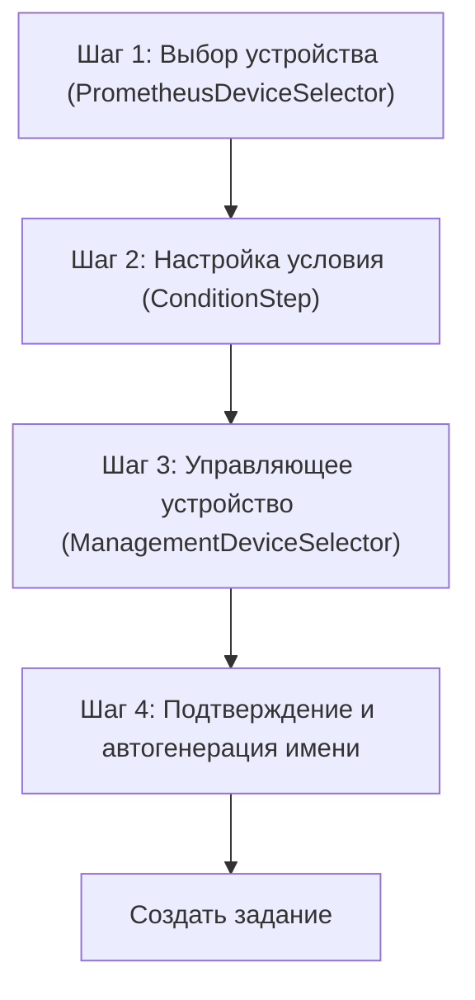

# 🎨 CREATIVE PHASE: UI/UX Redesign JobDialog

## PROBLEM STATEMENT

Текущий диалог создания/редактирования Job:
- Слишком сложен для пользователя (много полей, неочевидная логика).
- Нет четкого разделения между устройствами мониторинга (Prometheus) и управляющими устройствами (SMS).
- Пользователь вручную вводит имя задания, что приводит к ошибкам и дублированию.
- Нет визуального отображения актуальных метрик Prometheus при настройке условий.
- UX не соответствует современным стандартам (мастер, пошаговый ввод, визуальные подсказки).

**Цель:**  
Сделать создание задания максимально простым, интуитивным и быстрым для пользователя любого уровня.

---

## OPTIONS ANALYSIS

### Option 1: Мастер (Wizard) — Пошаговый интерфейс

**Описание:**  
Пользователь проходит 4 шага:
1. Выбор устройства для мониторинга (Prometheus, имя + MAC)
2. Настройка условия (метрика, оператор, значение, просмотр актуального значения)
3. Выбор управляющего устройства и команды (SMS)
4. Подтверждение и автоматическое имя

**Плюсы:**
- Минимум информации на каждом шаге, не пугает новичков
- Легко добавить подсказки и визуальные подсказки
- Автоматическое именование на последнем шаге
- Соответствует современным паттернам (Onboarding, Setup Wizard)
- Легко валидировать каждый шаг

**Минусы:**
- Больше кликов (4 экрана)
- Сложнее реализовать переходы назад/вперед
- Неудобно для массового создания заданий

**Сложность:** Средняя  
**Время реализации:** 2-3 дня фронт + 1 день бэкенд

---

### Option 2: Табы (Tabbed Form)

**Описание:**  
Вся форма делится на 3 вкладки:
- "Мониторинг" (выбор устройства, условия)
- "Действия" (управляющее устройство, команда)
- "Общее" (описание, статус, имя — автогенерируется)

**Плюсы:**
- Быстрый доступ к любой секции
- Можно быстро переключаться между условиями и действиями
- Хорошо для опытных пользователей

**Минусы:**
- Пользователь может пропустить важные шаги
- Неочевидная последовательность для новичков
- Сложнее валидировать заполнение всех секций

**Сложность:** Средняя  
**Время реализации:** 2 дня фронт + 1 день бэкенд

---

### Option 3: Минималистичная одностраничная форма

**Описание:**  
Вся логика на одной странице, поля сгруппированы по блокам, автоскролл к ошибкам.

**Плюсы:**
- Минимум кликов
- Быстро для опытных пользователей
- Легко реализовать

**Минусы:**
- Перегруженность для новичков
- Сложно встроить подсказки и визуальные подсказки
- Много ошибок при заполнении

**Сложность:** Низкая  
**Время реализации:** 1-1.5 дня фронт + 0.5 дня бэкенд

---

## PROS & CONS SUMMARY

| Вариант      | Удобство для новичков | Удобство для опытных | Соответствие style guide | Простота реализации | Массовое создание |
|--------------|----------------------|----------------------|-------------------------|--------------------|------------------|
| Мастер       | +++                  | ++                   | +++                     | ++                 | -                |
| Табы         | ++                   | +++                  | ++                      | ++                 | +-               |
| Одна страница| +                    | +++                  | +                       | +++                | +                |

---

## DECISION

**Рекомендуемый подход:**  
**Мастер (Wizard)** — пошаговый интерфейс с автогенерацией имени и визуальными подсказками.

**Обоснование:**  
- Максимально снижает порог входа для новых пользователей.
- Позволяет встроить подсказки, визуализацию метрик, автогенерацию имени.
- Легко валидировать каждый шаг.
- Соответствует style guide (Tailwind, карточки, кнопки, цветовая схема).
- Можно расширять (например, добавить массовое создание в будущем).

---

## IMPLEMENTATION PLAN

1. **Шаг 1:**  
   - Компонент выбора устройства мониторинга (PrometheusDeviceSelector)
   - Список: имя устройства + MAC, поиск, фильтр по платформе

2. **Шаг 2:**  
   - Компонент настройки условия (ConditionStep)
   - Выбор метрики, оператор, значение
   - Отображение актуального значения из Prometheus
   - Валидация типа данных

3. **Шаг 3:**  
   - Компонент выбора управляющего устройства (ManagementDeviceSelector)
   - Список устройств, выбор шаблона команды
   - Подгрузка шаблона при выборе устройства

4. **Шаг 4:**  
   - Подтверждение, автогенерация имени ("Мониторинг [Имя устройства] - [Условие]")
   - Просмотр всех выбранных параметров
   - Кнопка "Создать задание"

5. **Общее:**  
   - Использовать компоненты из style guide (кнопки, карточки, поля)
   - Tailwind классы из style guide
   - Адаптивность (мобильная версия)
   - Валидация на каждом шаге

---

## VISUALIZATION

---

🎨 CREATIVE CHECKPOINT: Wireframe & UX Decision зафиксированы

---

## Дальнейшие шаги

- Описать UX для Device Selection и алгоритм автогенерации имени (следующие creative phases)
- Обновить tasks.md с решением и рекомендациями

🎨🎨🎨 EXITING CREATIVE PHASE - DECISION MADE 🎨🎨🎨 

## Универсальные метрики и карточки условий

- UI должен поддерживать любые метрики (статус, температура, напряжение и др.)
- Для каждой метрики отображать:
  - Человекочитаемое название
  - Техническое имя
  - Единицы измерения (если есть)
  - Краткое описание/пояснение
- В карточке условия всегда показывать:
  - Имя устройства мониторинга (тип/модель)
  - Метрика (название + техническое имя)
  - Оператор
  - Значение (с единицами)
  - Пояснение к метрике (если есть)
- В карточке действия:
  - Имя устройства управления (тип/модель)
  - Тип действия
  - Команда/шаблон
- В верхней части — человекочитаемое описание сценария ("Если ... то ...") 

### UX: Выбор шаблона команды, категории и параметров

- При выборе устройства управления:
  - Сначала выбирается категория команды
  - Затем команда из шаблона
  - Если команда требует параметры — появляется форма для ввода (например, «Минуты: [ 10 ]»)
  - Итоговая строка команды формируется автоматически и показывается пользователю
- Для каждой команды — человекочитаемое описание и подсказка по параметрам
- В карточке действия отображать:
  - Название команды (человекочитаемо)
  - Итоговая строка команды (технически)
  - Введённые параметры (если есть) 