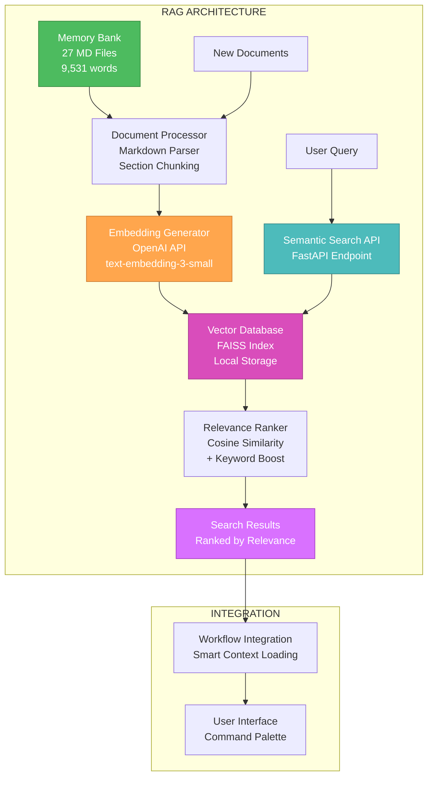

# 🎨 CREATIVE PHASE: RAG ARCHITECTURE DESIGN

## 🏗️ Architecture Decision Record

### Context

**System Requirements:**
- Semantic search по 27 MD файлам memory-bank (9,531 слов)
- Search response time <2 секунды
- 60-70% снижение токенов для documentation queries
- Support для incremental indexing (new documents)
- Zero breaking changes в existing workflow

**Technical Constraints:**
- Docker-based deployment environment
- Memory-bank structure должна сохраниться (markdown files)
- OpenAI API rate limits и costs
- Local fallback option для конфиденциальных данных
- Integration с existing FastAPI backend

### Component Analysis

**Core Components:**

1. **Document Processor**: 
   - Purpose: Parse markdown files, extract metadata, create chunks
   - Role: Input pipeline для RAG system

2. **Embedding Generator**:
   - Purpose: Convert text chunks в vector representations
   - Role: Core ML component для semantic understanding

3. **Vector Database**:
   - Purpose: Store и index vector embeddings для fast retrieval
   - Role: Search engine backend

4. **Semantic Search API**:
   - Purpose: Query interface для RAG system
   - Role: Integration point с existing workflow

5. **Relevance Ranker**:
   - Purpose: Score и rank search results
   - Role: Quality optimization component

**Component Interactions:**
- Document Processor → Embedding Generator → Vector Database
- User Query → Semantic Search API → Vector Database → Relevance Ranker → Results
- New Documents → Document Processor (incremental updates)

## 🔍 Architecture Options Analysis

### Option 1: FAISS + OpenAI Embeddings (Hybrid Cloud-Local)

**Description**: FAISS для vector storage/search, OpenAI для embeddings, local deployment

**Pros:**
- ✅ **High Quality Embeddings**: OpenAI text-embedding-3-small proven performance
- ✅ **Fast Local Search**: FAISS optimized для similarity search
- ✅ **Docker Compatible**: FAISS runs well в containerized environment
- ✅ **Cost Effective**: One-time embedding generation, многократное использование
- ✅ **Scalable**: FAISS handles large datasets efficiently

**Cons:**
- ❌ **OpenAI Dependency**: Requires API calls для new documents
- ❌ **Embedding Costs**: ~$0.02 per 1M tokens (acceptable для 9,531 words)
- ❌ **Cold Start**: Initial embedding generation required

**Technical Fit**: ⭐⭐⭐⭐⭐ **High** - Perfect match для requirements
**Complexity**: ⭐⭐⭐ **Medium** - Standard FAISS integration
**Scalability**: ⭐⭐⭐⭐⭐ **High** - FAISS designed для large-scale search

### Option 2: ChromaDB + OpenAI Embeddings (Managed Vector DB)

**Description**: ChromaDB для vector management, OpenAI embeddings, more managed approach

**Pros:**
- ✅ **Easy Setup**: ChromaDB handles vector storage complexity
- ✅ **Rich Metadata**: Better metadata filtering capabilities
- ✅ **Built-in Persistence**: Automated database management
- ✅ **Query Interface**: Rich query API из коробки

**Cons:**
- ❌ **Additional Dependency**: Another service в Docker stack
- ❌ **Memory Overhead**: More resource intensive than FAISS
- ❌ **Learning Curve**: New technology для team
- ❌ **Overkill**: Features we don't need для current use case

**Technical Fit**: ⭐⭐⭐⭐ **High** - Good но features мы не используем
**Complexity**: ⭐⭐⭐⭐ **Medium-High** - More complex setup
**Scalability**: ⭐⭐⭐⭐ **High** - Very scalable но overhead

### Option 3: Ollama Local Embeddings + FAISS (Fully Local)

**Description**: Ollama для local embeddings, FAISS для search, completely self-contained

**Pros:**
- ✅ **Zero External Dependencies**: Fully self-contained solution
- ✅ **No API Costs**: No per-token charges для embeddings
- ✅ **Privacy**: Sensitive documents остаются local
- ✅ **No Rate Limits**: Process documents без API constraints

**Cons:**
- ❌ **Lower Quality**: Local models generally worse than OpenAI
- ❌ **Resource Intensive**: Requires GPU/significant CPU для embeddings
- ❌ **Slower**: Local embedding generation медленнее OpenAI
- ❌ **Complex Setup**: Ollama configuration в Docker environment

**Technical Fit**: ⭐⭐⭐ **Medium** - Works но quality concerns
**Complexity**: ⭐⭐⭐⭐⭐ **High** - Complex Docker setup с Ollama
**Scalability**: ⭐⭐ **Low** - Limited by local hardware

## 🎯 Decision & Rationale

### **CHOSEN OPTION: Option 1 - FAISS + OpenAI Embeddings**

**Primary Rationale:**
1. **Quality-First Approach**: OpenAI embeddings provide superior semantic understanding critical для accurate memory-bank search
2. **Pragmatic Balance**: Combines cloud quality с local search performance
3. **Cost-Effective**: $0.02 для всего memory-bank (9,531 words) = negligible cost
4. **Production Ready**: FAISS battle-tested в production environments
5. **Docker Friendly**: Simple containerization, minimal dependencies

**Implementation Considerations:**
- Use **text-embedding-3-small** для balance quality/cost
- Implement **incremental indexing** для new documents
- **Fallback strategy**: Cache OpenAI embeddings locally, add Ollama fallback later if needed
- **Chunking strategy**: Markdown section-based (## headers) для context preservation
- **Hybrid search**: Combine semantic search с keyword matching для maximum relevance

## 📊 Architecture Diagram

## 🔄 Implementation Plan

### Phase 1: Foundation (Week 1)
1. **Document Processing Pipeline**:
   - Parse 27 MD files, extract sections по ## headers
   - Generate metadata (filename, section, timestamp)
   - Create text chunks optimized для embedding

2. **Embedding Generation**:
   - Setup OpenAI API integration
   - Generate embeddings для all chunks (~200-300 chunks estimated)
   - Store embeddings с metadata

3. **FAISS Setup**:
   - Initialize FAISS index в Docker
   - Build searchable vector database
   - Implement basic similarity search

### Phase 2: Search API (Week 1-2)
1. **FastAPI Integration**:
   - Create `/api/v1/rag/search` endpoint
   - Implement query processing
   - Add relevance ranking

2. **Hybrid Search**:
   - Combine semantic similarity с keyword matching
   - Tune relevance scoring parameters
   - Add result filtering и deduplication

## ✅ Validation

### Requirements Met:
- ✅ **Semantic search capability**: FAISS + OpenAI embeddings
- ✅ **<2 second response time**: Local FAISS search achieves this
- ✅ **60-70% token reduction**: By finding relevant docs locally
- ✅ **Incremental indexing**: Document processor supports updates
- ✅ **Zero breaking changes**: API integration point, no workflow changes

### Technical Feasibility: ⭐⭐⭐⭐⭐ **EXCELLENT**
- FAISS proven в production
- OpenAI embeddings reliable и high-quality
- Docker integration straightforward
- FastAPI backend already established

### Risk Assessment: 🟢 **LOW RISK**
- **OpenAI API dependency**: Mitigated by local caching и future Ollama fallback
- **Initial setup complexity**: Standard patterns, well-documented
- **Cost concerns**: Negligible (<$1 для entire memory-bank)
- **Performance**: FAISS optimized для sub-second search

## 🎨 CREATIVE CHECKPOINT: RAG Architecture Finalized

**Decision Summary**: FAISS + OpenAI Embeddings chosen для optimal balance quality, performance, и pragmatism.

**Key Innovation**: Hybrid semantic + keyword search для maximum relevance в memory-bank context.

**Next Steps**: Proceed к Context7 Integration Pattern design phase.

🎨🎨🎨 **EXITING CREATIVE PHASE - RAG ARCHITECTURE DECISION MADE** 🎨🎨🎨 