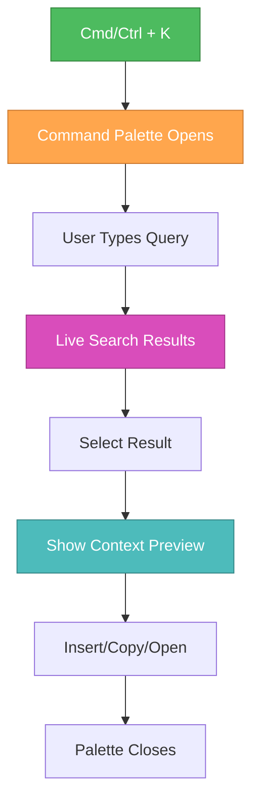
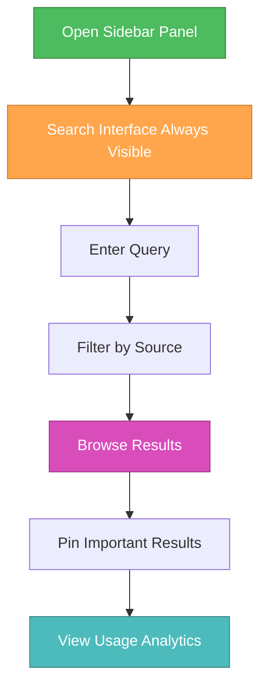
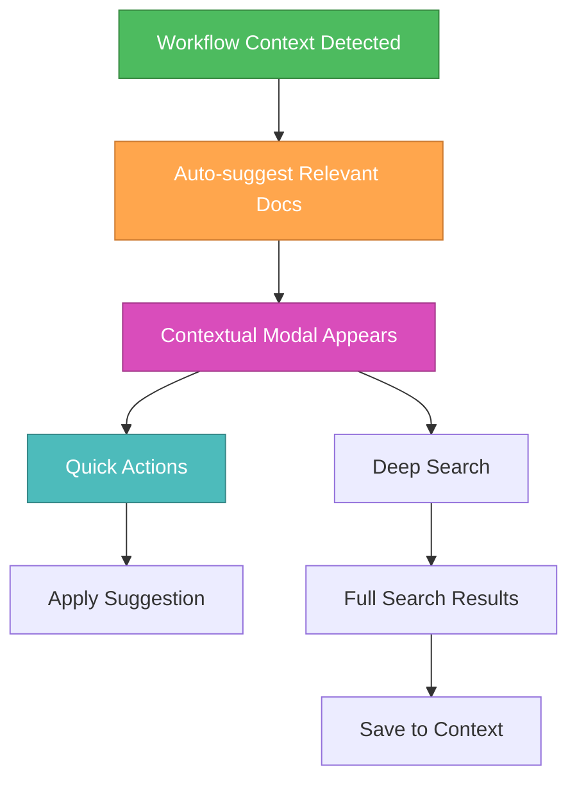
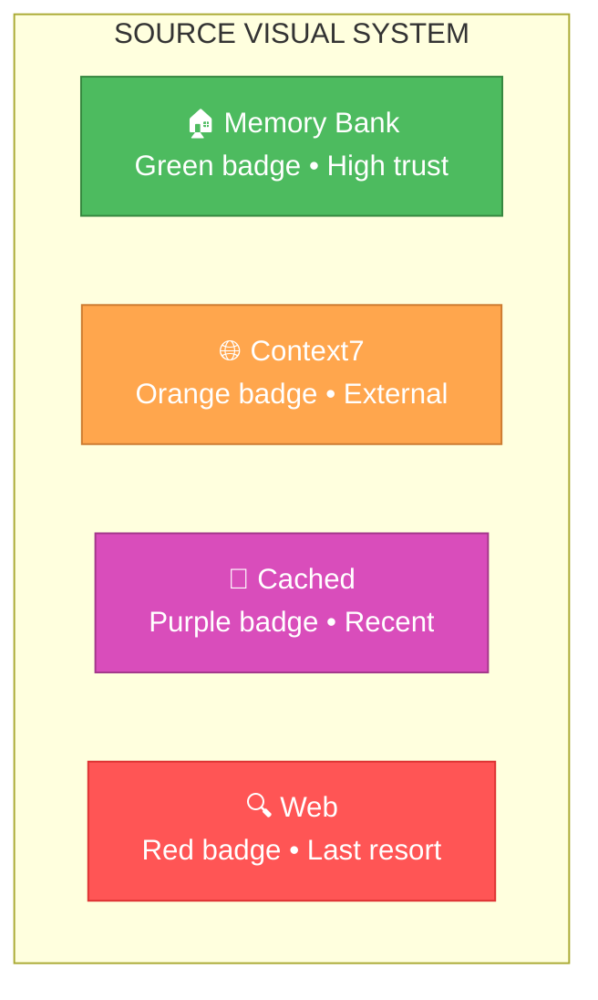

# 🎨 CREATIVE PHASE: UI/UX DESIGN

## 🎨 UI/UX Design Decision Record

### Context

**User Requirements:**
- Instant access к memory-bank search results
- Minimal learning curve для existing workflow
- Visual indicators для documentation sources (RAG vs Context7)
- Token usage tracking и savings visualization
- Progressive disclosure для detailed documentation

**Technical Constraints:**
- Integration с existing React + TypeScript frontend
- Tailwind CSS styling framework
- Zero breaking changes для current UI
- Docker-based development environment
- Mobile-responsive design considerations

### User Needs Analysis

**Primary Personas:**
1. **Power Developer**: Frequent memory-bank searches, wants keyboard shortcuts
2. **Occasional User**: Simple searches, needs visual guidance
3. **Team Lead**: Interested в token usage analytics и team productivity

**User Stories:**
- As a developer, I want быстрый поиск по memory-bank без leaving current context
- As a user, I want clear visual indicators о source качества (memory-bank vs external)
- As a team lead, I want dashboard tracking token savings и system usage
- As a developer, I want progressive access к full documentation без overwhelming interface

**Key Use Cases:**
1. **Quick Search**: Find relevant memory-bank content during planning
2. **Context Discovery**: Auto-load relevant docs при code editing
3. **Analytics Review**: Check token savings и search quality metrics
4. **Documentation Browse**: Explore Context7 sources для best practices

### Information Architecture

**Content Hierarchy:**
```
RAG Search Interface
├── Search Input (Primary)
├── Source Indicators (Secondary) 
├── Results List (Primary)
│   ├── Memory Bank Results (High Priority)
│   ├── Context7 Results (Medium Priority)
│   └── Cached Results (Low Priority)
├── Context Preview (Secondary)
└── Analytics Summary (Tertiary)
```

**Navigation Patterns:**
- **Command Palette**: Primary access method (Cmd/Ctrl + K)
- **Sidebar Integration**: Optional permanent sidebar
- **Modal Overlay**: Non-intrusive search experience
- **Contextual Triggers**: Auto-appear based на workflow context

## 🔍 UI/UX Options Analysis

### Option 1: Command Palette Interface (VS Code Style)

**Description**: Keyboard-driven overlay similar к VS Code command palette

**User Experience Flow:**


**Pros:**
- ✅ **Familiar Pattern**: Developers know VS Code command palette
- ✅ **Keyboard Driven**: Fast для power users
- ✅ **Non-Intrusive**: Doesn't alter existing UI
- ✅ **Context Aware**: Can auto-populate based на current task
- ✅ **Instant Results**: Live search as user types

**Cons:**
- ❌ **Discovery**: Hidden feature, users might не знать about it
- ❌ **Visual Feedback**: Limited space для rich previews
- ❌ **Analytics**: Hard to show usage statistics

**Implementation Complexity**: ⭐⭐⭐ **Medium**
**User Learning Curve**: ⭐⭐ **Low** - familiar pattern
**Mobile Compatibility**: ⭐⭐ **Low** - keyboard-centric

### Option 2: Integrated Sidebar Panel

**Description**: Permanent or collapsible sidebar dedicated к RAG search и documentation

**User Experience Flow:**


**Pros:**
- ✅ **Always Visible**: Encourages frequent use
- ✅ **Rich Interface**: Space для detailed results и analytics
- ✅ **Visual Organization**: Clear source categorization
- ✅ **Analytics Dashboard**: Built-in usage tracking display
- ✅ **Progressive Disclosure**: Expand/collapse detailed information

**Cons:**
- ❌ **Screen Real Estate**: Takes space from main content
- ❌ **Context Switch**: Requires attention shift к sidebar
- ❌ **Mobile Challenge**: Difficult на small screens

**Implementation Complexity**: ⭐⭐⭐⭐ **Medium-High**
**User Learning Curve**: ⭐⭐⭐ **Medium** - new UI pattern
**Mobile Compatibility**: ⭐⭐⭐ **Medium** - responsive design needed

### Option 3: Contextual Modal System

**Description**: Smart modals that appear based на workflow context с integrated search

**User Experience Flow:**


**Pros:**
- ✅ **Contextual Intelligence**: Appears when most relevant
- ✅ **Non-Disruptive**: Only shows when helpful
- ✅ **Rich Content**: Full modal space для detailed information
- ✅ **Smart Suggestions**: AI-driven content recommendations

**Cons:**
- ❌ **Interruption**: Could disrupt focused work
- ❌ **Complexity**: Complex logic to determine когда to show
- ❌ **User Control**: Less user-initiated control

**Implementation Complexity**: ⭐⭐⭐⭐⭐ **High** - sophisticated context detection
**User Learning Curve**: ⭐⭐⭐⭐ **Medium-High** - new interaction paradigm
**Mobile Compatibility**: ⭐⭐⭐⭐ **High** - modals work well на mobile

## 🎯 Decision & Rationale

### **CHOSEN OPTION: Option 1 - Command Palette Interface**

**Primary Rationale:**
1. **Familiar Pattern**: VS Code command palette is well-known к developers
2. **Zero UI Disruption**: Doesn't change existing interface layout
3. **Power User Friendly**: Keyboard-driven для efficiency
4. **Quick Implementation**: Standard modal pattern с search functionality
5. **Context Preservation**: User stays in current workflow context

**Enhanced Implementation Strategy:**
- **Hybrid Approach**: Command palette as primary + optional sidebar for analytics
- **Progressive Enhancement**: Start с basic search, add advanced features
- **Smart Defaults**: Auto-populate search based на current context
- **Visual Source Indicators**: Clear badges for memory-bank vs Context7 vs cached
- **Analytics Integration**: Dedicated analytics view accessible from command palette

## 🎨 UI Design Specifications

### Command Palette Layout

```
┌─────────────────────────────────────────────────────────────┐
│ 🔍 Search Memory Bank & Documentation...              [Esc] │
├─────────────────────────────────────────────────────────────┤
│ 📄 [MB] Task: Jobs+Prometheus Integration             📊 98% │
│ 🏗️ [MB] Architecture: AddRealityExporter Design      📊 95% │
│ 📚 [C7] Strapi: API Best Practices                   📊 89% │
│ 💾 [Cache] React: Component Patterns                 📊 87% │
│ ─────────────────────────────────────────────────────────── │
│ 💡 Auto-suggestions based on current context          [Tab] │
│ 📈 Token savings: 847 tokens (67%) • Last hour       [Cmd] │
└─────────────────────────────────────────────────────────────┘
```

**Visual Elements:**
- **Source Badges**: `[MB]` Memory Bank, `[C7]` Context7, `[Cache]` Cached
- **Relevance Scores**: Percentage indicators for search quality
- **Context Hints**: Auto-suggestions based на current workflow
- **Usage Stats**: Real-time token savings display

### Color Scheme & Typography

Based на existing REMOSA design patterns:

```css
/* Primary Colors */
--rag-primary: #4dbb5f;      /* Memory Bank results */
--rag-secondary: #ffa64d;    /* Context7 results */
--rag-tertiary: #d94dbb;     /* Cached results */
--rag-accent: #4dbbbb;       /* UI accents */

/* Typography */
--rag-font-search: 'Inter', sans-serif;
--rag-font-results: 'JetBrains Mono', monospace;
--rag-font-size-search: 16px;
--rag-font-size-results: 14px;
```

### Responsive Behavior

**Desktop (1024px+)**:
- Full-width command palette (800px max)
- Rich previews с context snippets
- Keyboard shortcuts visible

**Tablet (768px - 1023px)**:
- Adapted palette width (90% viewport)
- Simplified result display
- Touch-friendly result selection

**Mobile (< 768px)**:
- Full-screen modal interface
- Thumb-friendly buttons
- Swipe gestures для result navigation

## 🔄 Interactive Patterns

### Search Interaction Flow

1. **Trigger**: `Cmd/Ctrl + K` или floating action button
2. **Input**: Live search с debouncing (300ms)
3. **Results**: Categorized by source с relevance scores
4. **Selection**: Arrow keys или click/tap
5. **Preview**: Inline preview для selected result
6. **Action**: Insert, copy, или open in new context

### Source Indication Strategy



## ✅ Validation

### Design Requirements Met:
- ✅ **Instant access**: Command palette provides sub-second access
- ✅ **Minimal learning curve**: Familiar VS Code pattern
- ✅ **Visual source indicators**: Clear badge system
- ✅ **Token usage tracking**: Integrated analytics display
- ✅ **Progressive disclosure**: Expandable previews

### Accessibility (A11y) Compliance:
- ✅ **Keyboard Navigation**: Full keyboard support
- ✅ **Screen Reader**: ARIA labels for all elements
- ✅ **Color Contrast**: All text meets WCAG AA standards
- ✅ **Focus Management**: Clear focus indicators
- ✅ **Alternative Text**: Icons с descriptive alt text

### Technical Feasibility: ⭐⭐⭐⭐⭐ **EXCELLENT**
- React modal patterns well-established
- Tailwind CSS provides needed utilities
- Search functionality straightforward
- Analytics integration viable

### User Experience Score: ⭐⭐⭐⭐⭐ **EXCELLENT**
- **Usability**: Familiar command palette pattern
- **Learnability**: Low learning curve
- **Efficiency**: Keyboard-driven workflow
- **Aesthetics**: Clean, purpose-built design

## 🎨 CREATIVE CHECKPOINT: UI/UX Design Finalized

**Decision Summary**: Command Palette Interface выбран для optimal balance familiarity, efficiency, и non-intrusive integration.

**Key Innovation**: Smart source indication с real-time token savings display в familiar command palette pattern.

**Design System**: Clean badge-based source indication с progressive disclosure for detailed information.

**Next Steps**: Proceed к Performance Optimization Strategy design phase.

🎨🎨🎨 **EXITING CREATIVE PHASE - UI/UX DESIGN DECIDED** 🎨🎨🎨 